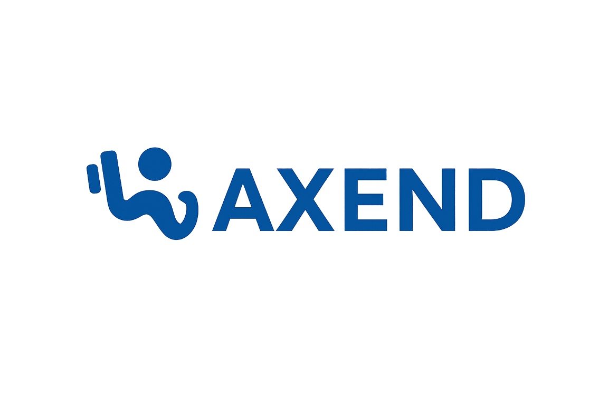

# 🏋️‍♂️ Axend - Plateforme de Coaching Fitness Nouvelle Génération

**La solution tout-en-un pour les coachs sportifs et leurs clients**

---

## 🌟 Vue d'ensemble

**Axend** révolutionne la relation coach-client dans le fitness avec une plateforme moderne, sécurisée et intuitive. Conçue avec les dernières technologies web, elle offre une expérience utilisateur exceptionnelle pour les professionnels du fitness et leurs clients.

### 🎯 Mission
Simplifier la gestion des programmes d'entraînement, le suivi des progrès et la communication entre coachs et clients.

---

## ✨ Fonctionnalités Principales

### 👨‍🏫 Espace Coach
- 📊 **Dashboard Intelligent** - Aperçu complet de tous vos clients
- 👥 **Gestion Clients** - Suivi personnalisé et historique détaillé
- 🏋️ **Création de Programmes** - Outils avancés de planification
- 📈 **Analyses & Rapports** - Statistiques de performance en temps réel
- 🔐 **Codes d'Accès** - Système d'invitation sécurisé

### 👤 Espace Client
- 🏠 **Dashboard Personnel** - Vue d'ensemble de votre progression
- 💪 **Suivi d'Entraînement** - Timer intégré et tracking en temps réel
- 📋 **Mes Programmes** - Accès à tous vos plans d'entraînement
- 📊 **Évolution Physique** - Graphiques de progrès détaillés
- ⚙️ **Paramètres** - Personnalisation de votre profil

---

## 🚀 Roadmap

### Phase 1 - MVP ✅
- [x] Authentification Supabase
- [x] Dashboards Coach/Client
- [x] Gestion des programmes
- [x] Suivi d'entraînement basique

### Phase 2 - Enrichissement 🔄
- [ ] 📸 Upload photos de progression
- [ ] 🍎 Module nutrition avancé
- [ ] 💬 Chat coach-client
- [ ] 📱 Progressive Web App (PWA)

### Phase 3 - Scale 🔮
- [ ] 🤖 IA pour recommandations
- [ ] 🌐 Multi-langues
- [ ] 💳 Système de paiement
- [ ] 📊 Analytics avancées

---

## 📞 Support & Contact

### 💌 Besoin d'aide ?

**Créé avec ❤️ par [Henri](https://github.com/HenriMly)**

---

### 🌟 Si ce projet vous plaît, n'hésitez pas à lui donner une étoile !

**Axend - Transformez votre passion du fitness en succès digital** 🚀

